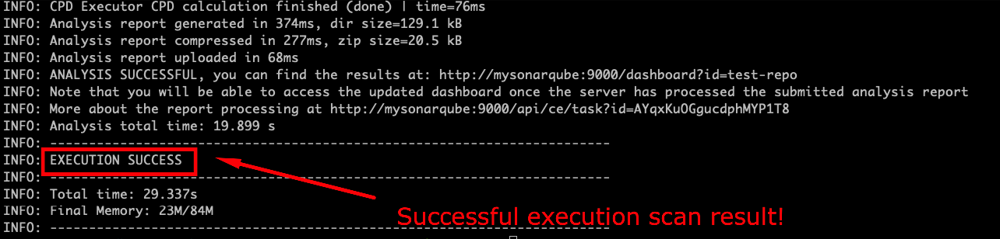

# SONARQUBE SCANNER CLI SETUP LOCALLY WITH DOCKER

This folder is just a "minor" example of a little repository that can check the SonarQube expected behavior on scans based on some sample `./src` and `./tests` folders. <br>

> Note: these folders do NOT represent the SonarQube Scanner setup, they are only for illustrating some sample code structure simulating another real repo.

## Execute the Unit Tests

First of all, make sure that the Unit Tests and Coverage Reports are generated. In this case, you can see the `test-unit-scanner` poetry task for the PyTest command and the Coverage commands. <br>

This should generate a `coverage.xml` file that will be used as input to SonarQube reports paths. <br>

In the [`sonar-project.properties`](sonar-project.properties), make sure that the following line is added:

```bash
sonar.python.coverage.reportPaths=coverage.xml
```

## Execute the SonarQube Scanner CLI

After the unit-tests and coverage report is run, update the `local-scanner-command.sh` with these variables as needed:

```bash
PROJECT_KEY=REPLACE_ME  # Usually same as repo name
SONARQUBE_URL=REPLACE_ME  # Endpoint for SonarQube (in this case the Docker SonarQube Service)
SONAR_TOKEN=REPLACE_ME  # Generated and obtained from SonarQube Server
```

Then proceed to execute the SonarQube Scanner CLI bash command as follows:

```bash
# Make sure to be inside the "scanner-setup" folder
cd docker/scanner-setup

# Run the SonarScanner CLI command
bash local-scanner-command.sh
```

After the previous command, we should expect the SonarScanner CLI connecting to the SonarQube Server, and scanning the files, considering as well the code coverage for the unit tests. The terminal results should look similar to these:

 <br>

And if we access the SonarQube Server, we should see our new project, with the Quality Gates passing because of a Code Coverage higher than 80% on new code (which is the default "Sonar Way" Quality Gate):

 <br>

## Next Steps

After these initial validations are in place, we can proceed to explore more CI/CD SonarScanner configurations, so that we can use them at any DevOps Pipeline Setup (GitLab, GitHub Actions, Azure DevOps, Jenkins, CodeBuild, CircleCI, etc...)
