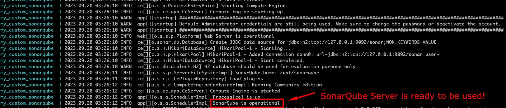
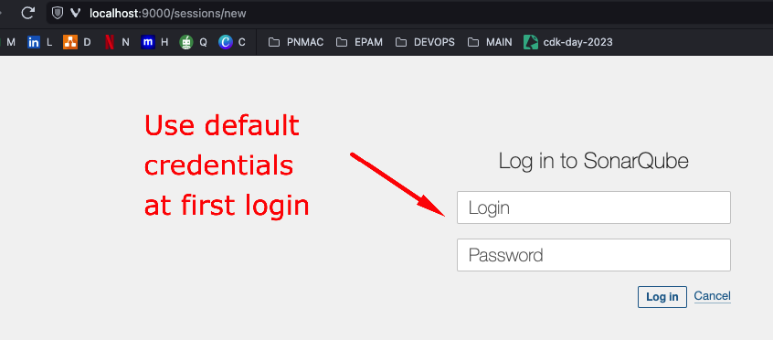
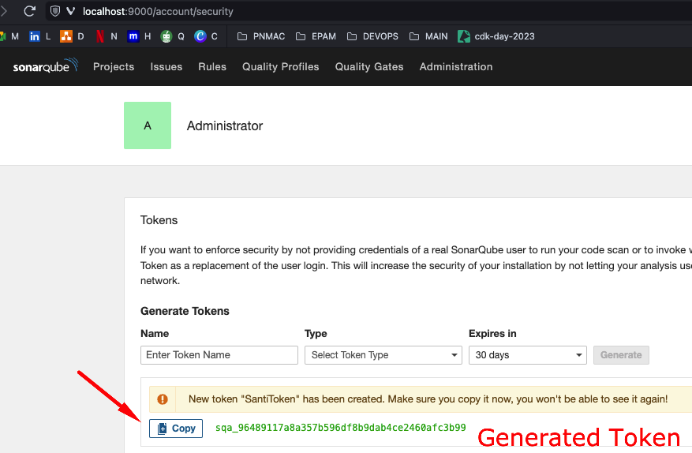

# SONARQUBE SERVER SETUP LOCALLY WITH DOCKER

This section of the repository is to explain how to run and setup the SonarQube Server locally with the Official [SonarQube Docker Image](https://hub.docker.com/_/sonarqube/). <br>

## Explanation

The image can be run with direct Docker commands, but to simplify it, we will use [Docker-Compose](https://docs.docker.com/compose/features-uses/) to define the SonarQube service and the Docker Configurations for it:

- [docker-compose.yml](docker-compose.yml)

Some important remarks about the configuration are:

- Ports:
  - `9000:90000` (expose port 9000 to our local network).
- Networks:
  - `devops_santi` (custom bridged Docker Network for my personal tests).
- Volumes:
  - `./sonarqube_home/data/:/opt/sonarqube/data` (SonarQube Database files H2).
  - `./sonarqube_home/logs/:/opt/sonarqube/logs` (SonarQube Logs).
  - `./sonarqube_home/extensions/:/opt/sonarqube/extensions` (SonarQube 3rd Party Plugins).
- Restart:
  - `always` (enables the Docker Container to be restarted if stopped).

## Start SonarQube Server

To run locally our SonarQube Server, proceed to move to the same level as the `docker-compose.yml` file, and initialize the service as follows:

```bash
docker-compose up
```

This command will initialize the server and load the default configurations. The terminal should show some logs similar to these ones:

```txt
my_custom_sonarqube  | 2023.09.20 03:26:11 INFO  ce[][o.s.c.c.CePluginRepository] Load plugins
my_custom_sonarqube  | 2023.09.20 03:26:12 INFO  ce[][o.s.c.c.ComputeEngineContainerImpl] Running Community edition
my_custom_sonarqube  | 2023.09.20 03:26:12 INFO  ce[][o.s.ce.app.CeServer] Compute Engine is started
my_custom_sonarqube  | 2023.09.20 03:26:12 INFO  app[][o.s.a.SchedulerImpl] Process[ce] is up
my_custom_sonarqube  | 2023.09.20 03:26:12 INFO  app[][o.s.a.SchedulerImpl] SonarQube is operational
```

 <br>

When the log `SonarQube is operational` is shown, this means that we are ready to use/test our SonarQube local server.

## Initial Setup

Then the previous step is run successfully, proceed to go to the following URL:

- http://localhost:9000

 <br>

And use the default username/password, which is:

- Username: `admin`
- Password: `admin`

> Update the credentials to a more robust/secure password and continue.

At this point, the SonarQube Server is ready to be used for CI/CD scans and Static Code Analysis validations.

## Token Creation

When the SonarQube Server is used from a CI/CD process, it usually requires an "authentication/authorization" mechanism different than the Username/Password provided in the previous step. <br>

To enable these scans, we can can create SonarQube **Tokens** that are used by the Pipelines. <br>

We have different ways of creating them, but a simple approach for generating them for local tests is:

1. Go to go to "Administrator" --> "My Account".
2. Then click on "Security".
3. Add a Token Name, for example "SantiToken".
4. Select "Global Analysis Token".
5. Click on "Generate"
6. Save the Token to be used in the CI/CD Sonar Scanner tasks.

 <br>

## Stop SonarQube Server

To remove the SonarQube Server, please execute:

```bash
docker-compose down
```

## Next Steps

After these initial validations are in place, we can proceed to explore more advanced SonarQube settings, as well as thinking of a cloud-based SonarQube Server, with some production-grade company wide organization setup. <br>
